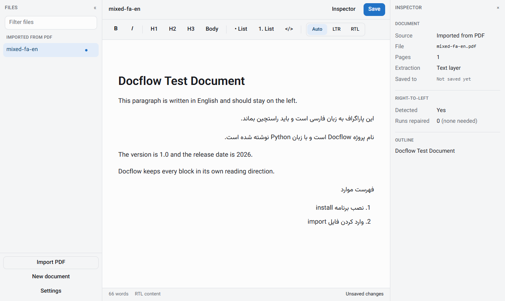
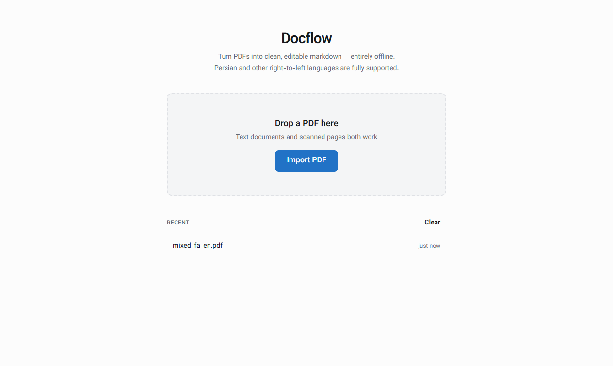
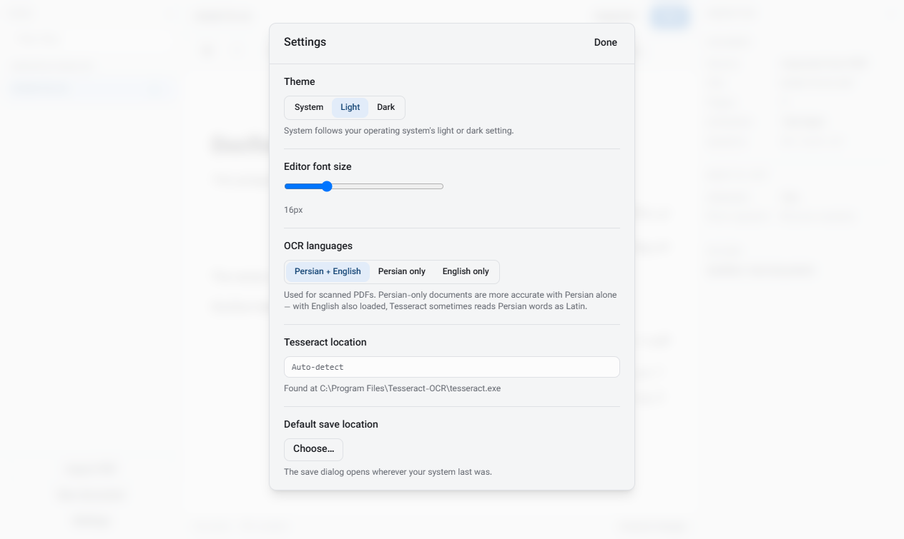

# Docflow

**Convert PDFs into clean, editable markdown — entirely offline, with Persian and
other right-to-left languages treated as a first-class case rather than an
afterthought.**



Every block in that screenshot decided its own reading direction. The English
paragraphs run left-to-right, the Persian ones right-to-left, and the sentence
containing both — `نام پروژه Docflow است و با زبان Python نوشته شده است.` — reads
correctly with its Latin words embedded in the right place. That is the whole
point of the project, and it is harder than it looks. See
[How right-to-left text is handled](#how-right-to-left-text-is-handled).

---

## Contents

- [Why this exists](#why-this-exists)
- [Features](#features)
- [Installing Docflow](#installing-docflow) — Windows · macOS · Linux
- [Installing Tesseract (for scanned PDFs)](#installing-tesseract-for-scanned-pdfs)
- [Building from source](#building-from-source)
- [How right-to-left text is handled](#how-right-to-left-text-is-handled)
- [Architecture](#architecture)
- [Testing](#testing)
- [Known limitations](#known-limitations)
- [Licence](#licence)

---

## Why this exists

Most PDF-to-markdown tools quietly mangle Persian. There are two classic failure
modes, and nearly every tool hits at least one:

1. **Letters do not join.** Arabic script is cursive; `س` `ل` `ا` `م` must connect
   into `سلام`. Extract carelessly and you get disconnected letterforms.
2. **Words come out backwards.** Text is *stored* in one order and *displayed* in
   another. Get the two confused and `گزارش` becomes `شرازگ`.

Docflow treats both as the core problem. It also handles the case that breaks
tools which "support RTL": **documents that mix directions**, where a Persian
paragraph sits next to an English one and a single sentence contains both.

## Features

- **Two extraction paths, chosen automatically.** Text-layer PDFs go through a
  markdown-aware extractor that preserves headings, lists and tables. Scanned
  PDFs fall back to OCR.
- **Per-block text direction**, inferred from each block's own content, with a
  one-click manual override when detection guesses wrong.
- **A real WYSIWYG editor** (Milkdown/ProseMirror) with clean markdown
  round-tripping — no HTML intermediate.
- **Genuine progress reporting** during conversion, driven by the parser itself
  rather than an indeterminate spinner.
- **Fully offline.** No network access at any point. The font is bundled, the
  parser is bundled, nothing phones home.
- **Light and dark themes**, and a bundled Persian/Latin matched font
  ([Vazirmatn](https://github.com/rastikerdar/vazirmatn)).

| Welcome screen | Settings |
| --- | --- |
|  |  |

---

## Installing Docflow

Download the build for your system from the
[Releases page](https://github.com/AliZabihian2004/DocFlow/releases).

> **Docflow is not code-signed.** It is a free, open-source project, and signing
> certificates cost a few hundred dollars a year. Every operating system will
> therefore warn you the first time you run it. The steps below explain how to
> get past that warning on each platform. If you would rather not trust an
> unsigned binary, [build it from source](#building-from-source) — the result is
> identical.

### Windows

**Requirements:** Windows 10 (64-bit) or later.

1. Download **`Docflow Setup 0.1.0.exe`** from the Releases page.
2. Run it. Windows SmartScreen will show a blue box reading
   *"Windows protected your PC"*.
3. Click **More info**, then the **Run anyway** button that appears.
   *(If you do not see "More info", the window is too small — resize it.)*
4. The installer wizard opens. Choose an install location, or accept the default
   of `C:\Users\<you>\AppData\Local\Programs\Docflow`, and click **Install**.
5. Launch Docflow from the Start menu or the desktop shortcut.

To uninstall: **Settings → Apps → Installed apps → Docflow → Uninstall**. Your
documents and preferences in `%APPDATA%\Docflow` are deliberately left alone.

### macOS

**Requirements:** macOS 11 Big Sur or later. Both Apple Silicon and Intel are
supported.

1. Download **`Docflow-0.1.0.dmg`** (Intel) or **`Docflow-0.1.0-arm64.dmg`**
   (Apple Silicon — M1 and later).
2. Open the `.dmg` and drag **Docflow** into your **Applications** folder.
3. **Do not double-click the app the first time.** Because it is unsigned and
   un-notarised, macOS will refuse with *"Docflow is damaged and can't be
   opened"* — which is misleading; nothing is damaged. Instead:
   - **Right-click** (or Control-click) the app in Applications
   - choose **Open**
   - click **Open** again in the dialog that appears.
4. If macOS still refuses, clear the quarantine flag from Terminal:

   ```bash
   xattr -dr com.apple.quarantine /Applications/Docflow.app
   ```

   Then open the app normally. You only ever need to do this once.

To uninstall: drag `Docflow.app` to the Trash. Preferences live in
`~/Library/Application Support/Docflow`.

### Linux

**Requirements:** a 64-bit distribution with glibc 2.31 or later (Ubuntu 20.04+,
Debian 11+, Fedora 34+).

#### AppImage — works on any distribution, no install

1. Download **`Docflow-0.1.0.AppImage`**.
2. Make it executable and run it:

   ```bash
   chmod +x Docflow-0.1.0.AppImage
   ./Docflow-0.1.0.AppImage
   ```

If it fails with a FUSE error, either install FUSE
(`sudo apt install libfuse2` on Debian/Ubuntu) or extract and run it directly:

```bash
./Docflow-0.1.0.AppImage --appimage-extract
./squashfs-root/AppRun
```

#### Debian / Ubuntu package

```bash
sudo apt install ./docflow_0.1.0_amd64.deb
docflow
```

To uninstall: `sudo apt remove docflow`. Preferences live in `~/.config/Docflow`.

---

## Installing Tesseract (for scanned PDFs)

**You only need this for scanned PDFs.** PDFs that already contain selectable
text work out of the box, and the parser picks the right path automatically.

Tesseract is a separate program, not bundled with Docflow — it is large, and
bundling it would roughly double the download for a feature many people never
use. **You must install the Persian (`fas`) language pack**, not just Tesseract
itself; without it, Persian OCR returns nonsense.

### Windows

1. Download the installer from the
   [UB Mannheim builds](https://github.com/UB-Mannheim/tesseract/wiki) — pick
   `tesseract-ocr-w64-setup-*.exe`.
2. Run it. **On the "Choose Components" screen, expand `Additional language
   data` and tick both `Persian (fas)` and `English (eng)`.** This is the step
   people skip.
3. Tick **Add to PATH** on the final screen if offered.
4. Verify in a **new** terminal:

   ```bash
   tesseract --list-langs
   ```

   You should see `eng` and `fas` in the list.

If it is not on your PATH, that is fine — Docflow also checks
`C:\Program Files\Tesseract-OCR` automatically, and you can point it anywhere
via **Settings → Tesseract location**.

### macOS

```bash
brew install tesseract tesseract-lang
```

`tesseract-lang` installs all language packs, including Persian. Verify with
`tesseract --list-langs`.

### Linux

```bash
# Debian / Ubuntu
sudo apt install tesseract-ocr tesseract-ocr-fas tesseract-ocr-eng

# Fedora
sudo dnf install tesseract tesseract-langpack-fas

# Arch
sudo pacman -S tesseract tesseract-data-fas tesseract-data-eng
```

### Checking it worked

Open **Settings** in Docflow. Under **OCR languages** you will either see
selectable options, or a message explaining that Tesseract could not be found.

---

## Building from source

The result is identical to the released binaries, and avoids the unsigned-binary
warnings entirely.

### Prerequisites — all platforms

| Tool | Version | Notes |
| --- | --- | --- |
| **Node.js** | 22 or later | Electron 44 requires it |
| **Python** | 3.10 or later | Developed against 3.14 |
| **Git** | any recent | |
| **Tesseract** | 5.x + `fas` | Optional; only for OCR |

### Platform-specific prerequisites

<details>
<summary><strong>Windows</strong></summary>

Install [Node.js](https://nodejs.org/) and
[Python](https://www.python.org/downloads/) — during the Python install, **tick
"Add python.exe to PATH"**.

Building the installer needs no extra tooling; `electron-builder` downloads what
it needs on first run.

</details>

<details>
<summary><strong>macOS</strong></summary>

```bash
brew install node python git
xcode-select --install   # command line tools, if not already present
```

</details>

<details>
<summary><strong>Linux (Debian / Ubuntu)</strong></summary>

```bash
sudo apt update
sudo apt install -y nodejs npm python3 python3-venv python3-pip git \
                    build-essential libfuse2
```

If your distribution ships an older Node, use
[nvm](https://github.com/nvm-sh/nvm) or [fnm](https://github.com/Schniz/fnm) to
install Node 22+.

</details>

### 1. Clone and install JavaScript dependencies

```bash
git clone https://github.com/AliZabihian2004/DocFlow.git
cd DocFlow
npm install
```

`npm install` also downloads the Electron binary through the `install-electron`
postinstall step. If `node_modules/electron/dist` ends up empty, run
`npx install-electron` manually — Electron 44 no longer does this on its own.

### 2. Set up the Python parser

**Windows:**

```bash
cd python-sidecar
python -m venv .venv
.venv\Scripts\python -m pip install --upgrade pip
.venv\Scripts\python -m pip install -r requirements-dev.txt
cd ..
```

**macOS / Linux:**

```bash
cd python-sidecar
python3 -m venv .venv
.venv/bin/python -m pip install --upgrade pip
.venv/bin/python -m pip install -r requirements-dev.txt
cd ..
```

### 3. Generate the test fixtures (optional)

Creates sample Persian PDFs — a text-layer one, a mixed-direction one, and a
scanned one — under `test-fixtures/generated/`:

```bash
python-sidecar/.venv/bin/python test-fixtures/generate.py     # macOS / Linux
python-sidecar\.venv\Scripts\python test-fixtures\generate.py  # Windows
```

On Windows this uses Tahoma for Persian glyphs. On macOS and Linux, edit
`FONT_PATH` in `test-fixtures/generate.py` to point at any font with Persian
coverage.

### 4. Run in development

```bash
npm run dev
```

The app launches with hot reload. In development it runs the parser from Python
source using the virtualenv, so there is no need to compile anything yet.

### 5. Build a distributable

The parser must be compiled **before** packaging the app, or you will ship an
application with no parser inside it. PyInstaller cannot cross-compile: each
platform's binary must be built on that platform.

```bash
# 1. compile the Python parser for this OS
bash build-scripts/build-sidecar-win.sh      # Windows (Git Bash)
bash build-scripts/build-sidecar-mac.sh      # macOS
bash build-scripts/build-sidecar-linux.sh    # Linux

# 2. package the app
npm run build:win     # -> release/Docflow Setup 0.1.0.exe
npm run build:mac     # -> release/Docflow-0.1.0.dmg
npm run build:linux   # -> release/Docflow-0.1.0.AppImage and .deb
```

Output lands in `release/`. An unpacked copy sits in `release/*-unpacked/`, which
is useful for testing without installing anything.

> **Build on the oldest system you intend to support.** A Linux binary built on
> Ubuntu 24.04 will not run on Ubuntu 20.04, because glibc is forward- but not
> backward-compatible.

---

## How right-to-left text is handled

This is the part of the project worth reading, and the reasoning behind it is
deliberately contrarian.

### The standard advice is wrong for this use case

Search for "Arabic text in Python" and you will be told to do this:

```python
import arabic_reshaper
from bidi.algorithm import get_display

fixed = get_display(arabic_reshaper.reshape(text))
```

That pair is genuinely correct — for rendering into something that does no text
shaping of its own, like matplotlib or reportlab. It converts text from *logical*
order (the order you type and store it) into *visual* order (the order glyphs are
painted on screen).

Docflow's output goes somewhere else entirely: a `.md` file, and an editor
running inside Chromium. Both expect **logical order**, and Chromium runs the
Unicode bidirectional algorithm itself. Feed it visually-ordered text and bidi
gets applied *twice*, reversing everything.

Measured, on a real extracted heading:

| Stage | Result |
| --- | --- |
| Extracted markdown | `# گزارش فنی` ✅ correct |
| After `reshape()` | `# ﮔﺰﺍﺭﺵ ﻓﻨﯽ` — swapped to presentation forms |
| After `get_display()` | `ﯽﻨﻓ ﺵﺭﺍﺰﮔ #` ❌ **reversed** |

Look at where the `#` ended up. The markdown heading marker moved to the *end of
the line*, so the output no longer parses as a heading at all.

**So Docflow does not use those libraries.** They are not dependencies. The job
here is the inverse: take whatever the PDF gives us and *guarantee* logical order
with ordinary base letters.

### Detecting reversed text without guessing

Some PDFs really do store text backwards. Detecting that is usually done with
heuristics or dictionaries. Docflow uses neither, because Arabic script carries
the answer in the encoding itself.

Arabic letters have four contextual forms — isolated, initial, medial, final —
and PDFs store the *pre-shaped* form of each glyph. Those forms encode position:

- a letter in **initial** form can only *begin* a word
- a letter in **final** form can only *end* one

So if a run of glyphs *ends* with an initial form, it is provably stored
backwards. No dictionary, no statistics, no ambiguity:

```
نرم  stored visually  ->  [meem isolated, reh final, noon initial]
                          ends in an *initial* form, which is impossible
                          in logical order  ->  reverse it
```

The Unicode database supplies the form directly — `unicodedata.decomposition()`
of `U+FEE7` is literally `<initial> 0646`. The implementation is in
[`python-sidecar/parser/rtl_fix.py`](python-sidecar/parser/rtl_fix.py), with
tests in [`python-sidecar/tests/test_rtl_fix.py`](python-sidecar/tests/test_rtl_fix.py).

Repairs are matched against *runs* rather than whole words, because the markdown
extractor drops the zero-width non-joiner inside Persian compounds and welds two
runs into a single token. When there is no evidence either way, Docflow leaves
the text alone: under-correcting preserves text that was already fine.

The parser also normalises characters that look identical but are not — Arabic
yeh `ي` (U+064A) to Persian yeh `ی` (U+06CC), Arabic kaf `ك` to keheh `ک`. These
render the same in most fonts but break search and comparison.

### Direction in the editor: why `dir="auto"` is not enough

HTML has a built-in answer, `dir="auto"`, which infers direction from content. It
is not sufficient, and both failures are reproducible:

| Setup | Expected | Actual |
| --- | --- | --- |
| Persian paragraph, `dir="auto"` on the editor root | `rtl` | **`ltr`** |
| `Docflow است یک برنامه`, own `dir="auto"` | `rtl` | **`ltr`** |

The first fails because `dir="auto"` on a container resolves **once**, from the
first strong character in the *whole* document — so one English heading forces
every Persian paragraph below it left-to-right.

The second fails because even per-block, `auto` only looks at the **first strong
character**. A Persian sentence opening with a Latin product name resolves
left-to-right despite being otherwise entirely Persian.

Docflow therefore decides each block from **which script actually dominates its
text**, as a ProseMirror plugin
([`rtl-plugin.ts`](src/renderer/components/Editor/rtl-plugin.ts)). Blocks with no
strong characters fall back to `auto`. Ties go to RTL.

List *containers* are decorated as well as list items — the item decides which
side its marker sits on, but the container owns the indentation, and decorating
only the item produces a Persian list with its markers on the right and its
indent on the left.

Direction is applied as ProseMirror **decorations, never as node attributes**. An
attribute would have to survive markdown serialisation, and markdown has no
syntax for direction — it would be dropped silently on save, and the document
would come back different from how it left.

### Typography

Persian is set in [Vazirmatn](https://github.com/rastikerdar/vazirmatn), bundled
as a single 111 KB variable font covering weights 100–900. It carries matched
Latin and Persian letterforms, so both scripts share one family rather than being
paired by hand — mismatched pairing, or letting Persian fall through to a system
default, is the most common way a multilingual interface ends up looking broken.

Persian also gets looser line spacing than Latin (1.9 vs 1.65), because
Arabic-script ascenders, descenders and diacritics collide at spacing that suits
Latin text. That is applied with the CSS `:dir(rtl)` pseudo-class, which matches
the *resolved* direction — an `[dir="rtl"]` attribute selector would miss every
auto-detected block.

Throughout the editor, spacing uses **CSS logical properties**
(`padding-inline-start`, `border-inline-start`, `text-align: start`) rather than
physical left/right, so a block flips cleanly when its direction does.

---

## Architecture

```
┌────────────────┐   contextBridge   ┌──────────────┐   JSON over stdio  ┌─────────────────┐
│   Renderer     │ ────────────────► │     Main     │ ─────────────────► │ Python sidecar  │
│ React + Milkdown│ ◄──────────────── │   Electron   │ ◄───────────────── │ PyMuPDF/Tesseract│
└────────────────┘    window.api     └──────────────┘   progress+result  └─────────────────┘
   no Node access     16 methods        owns all I/O      long-lived process
```

- The **renderer** is fully sandboxed: `contextIsolation: true`,
  `nodeIntegration: false`, `sandbox: true`. It reaches the outside world only
  through sixteen hand-written methods on `window.api`. There is deliberately no
  generic `invoke(channel, …)` passthrough, which would let any compromised
  renderer code reach every IPC handler in the app.
- The **main process** owns all filesystem access and the sidecar's lifecycle,
  including restarting it if it crashes (with a backoff that gives up rather than
  respawning forever).
- The **Python sidecar** is a long-lived child process, not spawned per request —
  importing PyMuPDF costs far more than any single parse. It speaks
  newline-delimited JSON, and every response carries the id of the request that
  caused it.

### Project layout

```
src/main/               Electron main process
  ipc/                  IPC handlers, grouped by domain
  python-bridge/        sidecar lifecycle and wire protocol
src/preload/            the contextBridge surface — the only way in
src/renderer/           React app
  components/Editor/    Milkdown canvas, toolbar, rtl-plugin
  state/store.ts        Zustand store
src/shared/types.ts     the cross-process contract
python-sidecar/         the parser
  parser/rtl_fix.py     right-to-left repair
  parser/extract.py     text-layer path
  parser/ocr.py         scanned path
```

---

## Testing

```bash
npm test                 # TypeScript: IPC round trip and direction detection
npm run typecheck        # both tsconfig projects

# Python parser tests
python-sidecar/.venv/bin/python -m pytest python-sidecar/tests -q     # macOS/Linux
python-sidecar\.venv\Scripts\python -m pytest python-sidecar\tests -q  # Windows
```

The TypeScript suite exercises the full renderer → main → sidecar round trip
against a mocked sidecar, including crash recovery and cancellation. The Python
suite covers the RTL repair logic against known input/output pairs, with all
special characters built from explicit codepoints — several of them are invisible
or visually identical to their neighbours, and spelling them out by number is the
only way a reader can tell what is being asserted.

---

## Known limitations

Stated plainly, because they are real:

- **OCR output is rough, and partly irreducibly so.** Sentence-final punctuation
  can land at the start of a line, and Persian compounds may split. OCR produces
  no presentation forms, so the joining-form evidence that makes the text-layer
  path reliable simply does not exist for scanned documents.
- **A manual direction override does not survive save and reopen.** Markdown
  cannot express direction. Automatic detection re-runs on load and usually gets
  it right; writing raw HTML into your markdown to preserve the override would be
  a worse trade.
- **Zero-width non-joiners are lost** in compounds such as `نرم‌افزار`, which
  becomes `نرمافزار`. Correct letters, correct order, missing half-space.
- **Some heading levels are missed** by the markdown extractor on certain
  documents; they come through as plain paragraphs.
- **Test fixtures are synthetic.** They are generated programmatically and do not
  reproduce every quirk of real Word or InDesign exports.
- **Builds are unsigned.** See [Installing Docflow](#installing-docflow).
- **No auto-update.** Download new versions from the Releases page.

---

## Licence

[MIT](LICENSE) © 2026 Ali Zabihian.

Bundled and depended upon:

- [Vazirmatn](https://github.com/rastikerdar/vazirmatn) — SIL Open Font Licence
  1.1 ([text](src/renderer/assets/fonts/OFL.txt)); bundled with the app
- [PyMuPDF](https://github.com/pymupdf/PyMuPDF) — AGPL-3.0
- [Tesseract OCR](https://github.com/tesseract-ocr/tesseract) — Apache-2.0; a
  separate installation, not bundled
- [Milkdown](https://milkdown.dev/) and [ProseMirror](https://prosemirror.net/) — MIT
- [Electron](https://electronjs.org/) — MIT

> **Note on PyMuPDF's licence:** PyMuPDF is AGPL-3.0. Docflow itself is MIT, but
> distributing a binary that bundles PyMuPDF carries AGPL obligations — the
> source must be available, which it is. If you intend to build a *closed-source*
> product on this code, review that licence carefully or obtain a commercial
> licence from Artifex.
